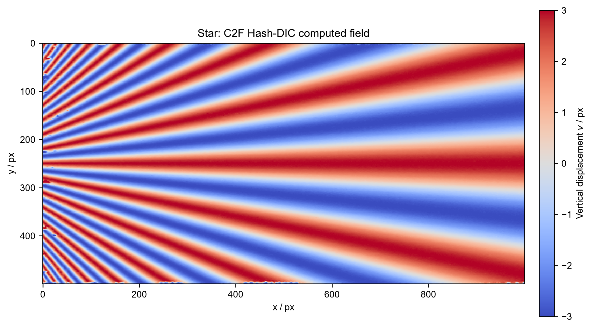
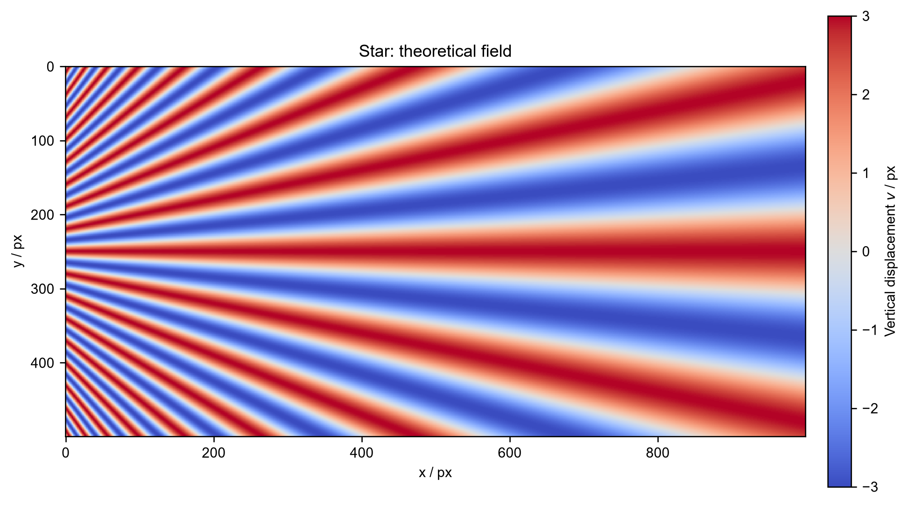
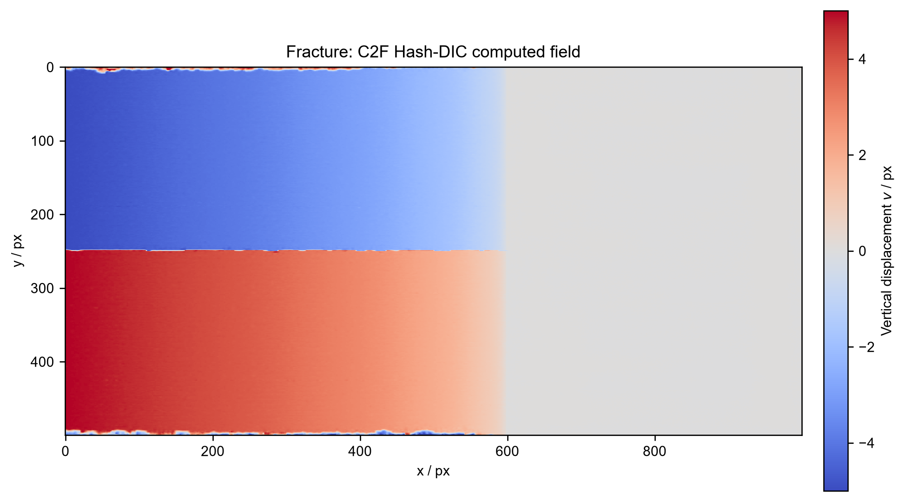
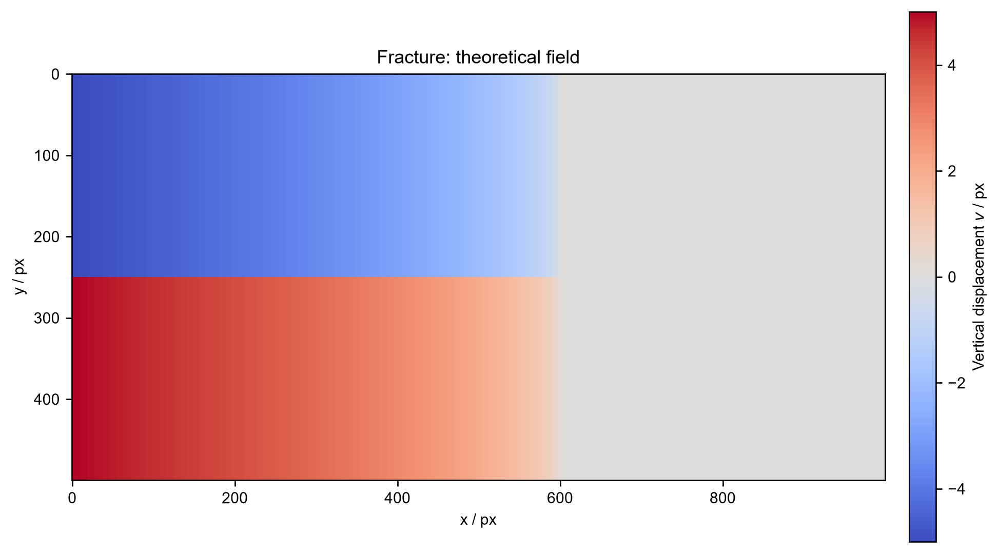

# C2F Hash-DIC

This repository provides a compact reproduction package for **C2F Hash-DIC**,
a coarse-to-fine digital image correlation method based on multiresolution hash
encoding. It contains the complete Python implementation and the source image
pairs for two synthetic validation cases:

- **Star:** a continuous displacement field with spatially varying frequency;
- **Fracture:** a discontinuous crack-opening displacement field.

本项目用于完整复现 C2F Hash-DIC 的 Star 与 Fracture 两组虚拟实验。仓库包含
复现代码、参考图像、变形图像以及计算/理论位移场图。

## Contents

```text
.
|-- run_reproduction.py
|-- README.md
|-- LICENSE
|-- data/
    |-- star_reference.bmp
    |-- star_deformed.bmp
    |-- fracture_reference.bmp
    `-- fracture_deformed.bmp
`-- figures/
    |-- star_computed.png
    |-- star_theoretical.png
    |-- fracture_computed.png
    `-- fracture_theoretical.png
```

## Star displacement field

**C2F Hash-DIC computed field**



**Theoretical field**



## Fracture displacement field

**C2F Hash-DIC computed field**



**Theoretical field**



## Run

Complete recomputation requires Python, NumPy, OpenCV, Matplotlib, torchvision,
a CUDA-enabled PyTorch installation, and the tiny-cuda-nn Python bindings.

Run both validation cases:

```bash
python run_reproduction.py --case all
```

The script performs the complete optimization and generates numerical results
and validation plots locally in `results/` and `figures/`.

## Licence

The Python implementation is released under the MIT License. The included
synthetic input images are released under CC BY 4.0; see `LICENSE`.
